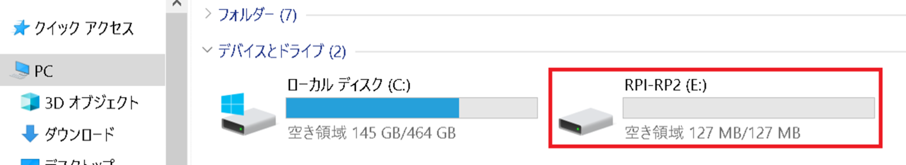
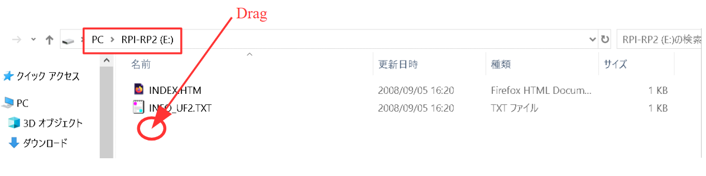
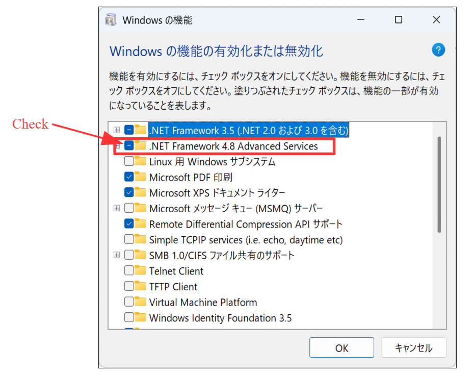
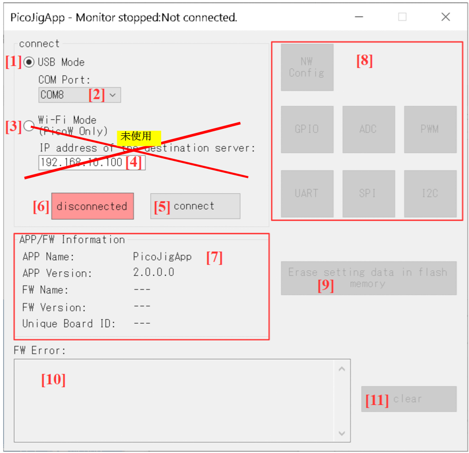
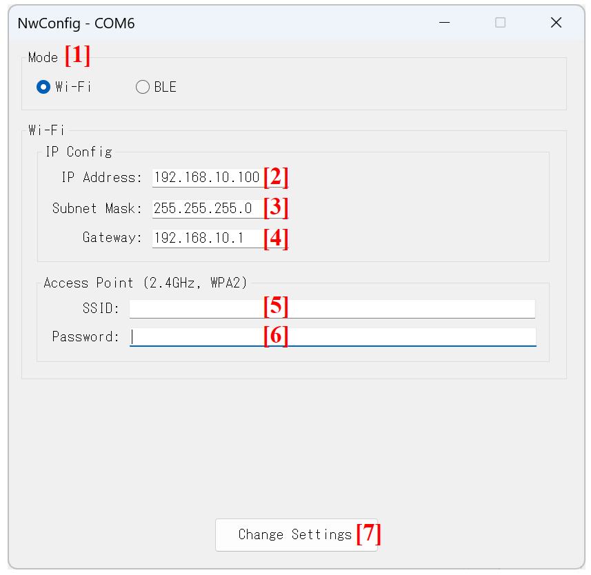
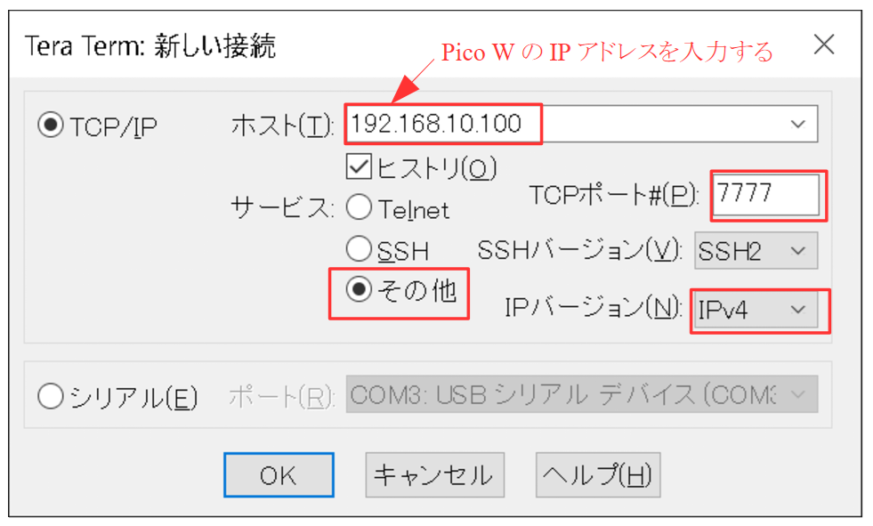
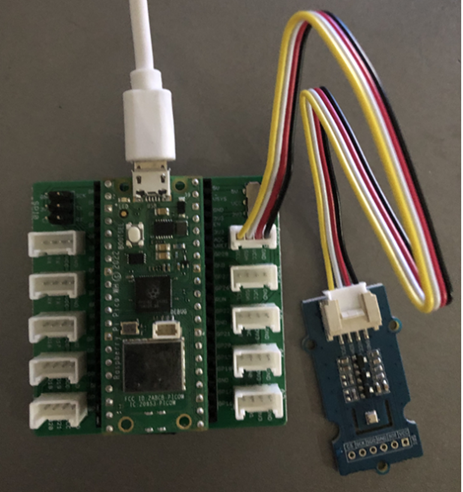

# PicoIotマニュアル

## 目次

- [利用規約](#利用規約)
- [概要](#概要)
  - [センサデータの種類](#センサデータの種類)
  - [設定の保存](#設定の保存)
  - [補足](#補足)
- [内容物](#内容物)
  - [ファームウェア（FW）](#ファームウェアfw)
  - [PCアプリ](#pcアプリ)
- [セットアップ](#セットアップ)
  - [Pico WにFWを書き込む](#pico-wにfwを書き込む)
  - [PC側のセットアップ](#pc側のセットアップ)
- [基本設定（PicoJigApp）](#基本設定picojigapp)
  - [PicoJigAppの起動](#picojigappの起動)
  - [基本設定](#基本設定)
  - [Flashメモリ内の設定データの消去](#flashメモリ内の設定データの消去)
- [Wi-Fiモード](#wi-fiモード)
  - [Webブラウザでのセンサデータ表示](#webブラウザでのセンサデータ表示)
  - [Webブラウザからのオプション設定](#webブラウザからのオプション設定)
  - [Eメール送信](#eメール送信)
  - [TCPソケット通信でJSONデータ送信](#tcpソケット通信でjsonデータ送信)
- [BLEモード](#bleモード)
  - [BLEでJSONデータ送信](#bleでjsonデータ送信)
- [ハードウェア・通信仕様](#ハードウェア通信仕様)
  - [LEDステータス](#ledステータス)
  - [使用ピン](#使用ピン)

## 利用規約

PicoIotを使用する場合、必ず下記の塩町ソフトウェアのウェブサイトの利用規約を確認して下さい。  
なお、PicoIotを使用したり本マニュアルの手順を実施したりして発生したいかなるトラブル・損失・損害についても、塩町ソフトウェア（PicoIotの作成者）は一切責任を負いません。

**利用規約のURL:**  
<https://sites.google.com/view/shiomachisoft/%E5%88%A9%E7%94%A8%E8%A6%8F%E7%B4%84>

## 概要

PicoIotは、Raspberry Pi Pico Wを使用した簡易IoTシステムです。  
各種センサ（GPIO入力、ADC電圧、BME280環境センサなど）から取得したデータを、Wi-FiやBLEを利用してPCやスマートフォンへ送信・表示することができます。

本システムには「Wi-Fiモード」と「BLEモード」の2つの通信モードがあり、用途に応じて以下の機能を活用できます。

- **Wi-Fiモード**  
  Wi-Fiルーターを経由してネットワークに接続する多機能モードです。
  - **Webブラウザでの確認:**  
    PCやスマホのブラウザからアクセスし、リアルタイムにデータを閲覧できます。
  - **Eメール送信:**  
    指定した間隔でのデータの「**定期送信**」や、センサ値が**しきい値**を超えた際の「**アラート通知**」を行います。    
  - **TCPソケット通信:**  
    Pico WがTCPサーバーとなり、**JSON**形式のデータを外部クライアント（Tera Termなど）に送信します。

- **BLEモード**  
  Bluetooth Low Energy (BLE) を利用して、スマートフォンなどと直接通信するモードです。
  - スマホの汎用のBLEアプリを使用して**JSON**形式のセンサデータを受信・確認できます。

### センサデータの種類

- Pico WのGPIO入力値
- Pico WのADC値（電圧値、温度センサ値）
- BoschのBME280（温度・気圧・湿度センサ、および不快指数などの計算値）のデータ ※1

※1: Pico WにBME280が接続されていない場合、送信されるセンサデータにBME280のデータは含まれません。

### 設定の保存

PicoIotの各種設定は、すべてPico W本体のFlashメモリに保存されます。  
設定項目に応じて、以下の2つの方法で設定を行います。

- **基本設定（PCアプリ）:**  
  通信モードやWi-FiのSSIDなどの基本的な設定は、専用のPCアプリから行います。
- **オプション設定（Webブラウザ）:**  
  EメールのSMTPサーバーやアラートなどのオプション設定は、Wi-FiモードでPCなどのWebブラウザ（Web設定画面）から行います。

### 補足

- **Eメール送信について:**  
  Pico Wのファームウェアにはメール送信サーバーの機能は含まれていません。Eメール送信機能を利用する場合は、外部のSMTPサーバーにメールの送信を依頼する形となります。  
  一般的なプロバイダのSMTPサーバーのほか、GmailのSMTPサーバーなども利用可能です。

- **センサデータのカスタマイズについて:**  
  Webブラウザでの表示内容やEメールの本文などは、内部で生成されるセンサのJSONデータから動的に作成されています。そのため、ユーザーがFWのソースコード（センサデータを取得してJSONを作成する部分）を変更するだけで、容易に表示・送信するデータをカスタマイズできます。  
  カスタマイズを行う場合は、`src` フォルダ内の以下のソースファイルを編集して下さい。なお、FWのソースコードはArduino IDEを使用し、C++で記述されています。
  - `Gpio.h`
  - `Gpio.cpp`
  - `Sensor2Json.h`
  - `Sensor2Json.cpp`

- **アラート処理のカスタマイズについて:**  
  センサデータがしきい値を超えた際の独自の処理を追加・変更したい場合は、同じく `src` フォルダ内の `Alert.cpp` を変更して下さい。

## 内容物

### ファームウェア（FW）

- **`PicoIot_XXXXXXXX.uf2`**  
  ※ `XXXXXXXX` はバージョン日付です。  
  Pico Wに書き込みます。

### PCアプリ

- **PicoJigAppフォルダ**  
  このフォルダには、PicoJigApp（Windows PC上で実行するアプリ）のバイナリが含まれます。  
  PicoJigAppは、基本設定で使用します。

## セットアップ

### Pico WにFWを書き込む

以下は、Pico WにFWを書き込む手順です。

1. Pico WのBOOTSELボタン（白いボタン）を押しながらPCとPico WをUSBケーブルで接続すると、RPI-RP2のドライブが認識されます。

   

2. RPI-RP2の中に `PicoIot_XXXXXXXX.uf2` をドラッグ＆ドロップします。

   

以上で、FWの書き込みは終了です。  
なお、Pico Wの電源をONにしたタイミングでFWは自動的に起動します。

### PC側のセットアップ

1. PicoJigAppフォルダをPCの適当な場所（デスクトップなど）にフォルダごとコピーして下さい。

2. `.NET Framework`のバージョン確認

   - *Windows環境では、.NET Framework 4.6.2以降（4.x.x）が有効になっている必要があります。*`.NET 5`以上とは互換性がありません。
     - ※`.NET Framework`の有効化は自己責任です。
   - なお、Windows 11ではデフォルトで`.NET Framework 4.8`が有効になっているため、基本的に何もする必要はありません。Windowsで`.NET Framework 4.8`が有効になっているかどうかは、以下の手順で確認できます。
     - 「コントロール パネル」⇒「プログラム」⇒「Windowsの機能の有効化または無効化」を開きます。
     - `.NET Framework 4.8`のチェックボックスがONになっていることを確認します。
 
       


## 基本設定（PicoJigApp）

### PicoJigAppの起動

#### メイン画面



#### 起動と接続

1. Pico WをUSBケーブルでPCに接続し、10秒程度待ってから `PicoJigApp` フォルダ内の `PicoJigApp.exe` をダブルクリックして起動します。  
   ※10秒程度待つのは、WindowsがPico Wの仮想COMを認識するのに時間がかかるためです。  
   起動すると[メイン画面]が表示されます。

2. **[1]** については、"USB Mode"をONのままにします。

3. **[2]** のコンボボックスでPico WのCOM番号を選択した後、 **[5]** のボタンを押します。  
   **[6]** の表示が"connected"に変わっていればPico WとUSBで接続できています。  
   接続が完了すると、 **[8]** エリアの[NW Config]ボタン と **[9]** のボタンが有効になります。

### 基本設定

#### ネットワーク設定画面

ネットワーク設定画面は、[メイン画面]の **[8]** エリアの[NW Config]ボタンを押すと表示されます。



#### 通信モード設定

**[1]** のラジオボタンで、Pico Wの通信モード（Wi-FiまたはBLE）を選択します。
※デフォルトの通信モードはWi-Fiモードです。

#### Wi-Fi設定

Wi-Fiモードの場合、以下のWi-Fi設定が必須です。

1. **[2]** のボックスにPico WのIPアドレスを入力します。  
   **入力例:**   
   `192.168.10.100`

2. **[3]** と **[4]** のボックスに、それぞれサブネットマスクとデフォルトゲートウェイを入力します。  
   **入力例:**  
   Subnet Mask: `255.255.255.0`  
   Gateway: `192.168.10.1`

3. **[5]** のボックスにWi-FiルーターのSSIDを入力します。  
   ※接続可能なWi-Fiネットワーク（ルーター）の条件:
   - 2.4GHz帯を使用するWi-Fi規格「IEEE 802.11b/g/n」に対応していること（間違えて5GHzのSSIDを指定しないようにして下さい）。
   - WPA2の暗号化方式に対応していること。

4. **[6]** のボックスに、SSIDのパスワードを入力します。

5. **[7]** のボタンを押すと設定がFlashメモリに保存され、Pico Wが自動的に再起動します。

   Pico WのLEDがシングルフラッシュではなく **ダブルフラッシュ** になっていること（Pico WがWi-Fiルーターと接続できていること）を確認して下さい。

### Flashメモリ内の設定データの消去

設定データは、Pico WのFlashメモリ内の後方に保存されます。

※PicoIotをもう使用しない場合は、[メイン画面]の **[9]** のボタンでFlashメモリに保存されている設定データを消去することをお勧めします。


## Wi-Fiモード

### Webブラウザでのセンサデータ表示

#### WebブラウザでのURL入力

PCやスマホのWebブラウザでURLを入力します。

**入力例**（Pico WのIPアドレスが192.168.10.100の場合）

```text
http://192.168.10.100
```

#### Webブラウザでのセンサデータの表示

Webブラウザには以下のセンサデータが表形式で表示されます。画面は約5秒間隔で自動的に更新されます。

センサデータは先頭から下記の通りです。

- FW情報（FW_Name, FW_Ver）
- ボードID
- デバイス名（個体の識別名）
- GP10の入力レベル: 0 or 1
- GP11の入力レベル: 0 or 1
- GP12の入力レベル: 0 or 1
- GP13の入力レベル: 0 or 1
- GP14の入力レベル: 0 or 1
- GP15の入力レベル: 0 or 1
- ADC0の電圧[V]
- ADC1の電圧[V]
- ADC2の電圧[V]
- Pico Wの温度センサ値[℃]
- BME280のデータ（※BME280接続時のみ含まれます）
  - 温度[℃]
  - 湿度[%]
  - 気圧[hPa]
  - 不快指数
  - 露点温度[℃]
  - 絶対湿度[g/m³]
  - 簡易熱中症指数（WBGT）[℃]

### Webブラウザからのオプション設定

ブラウザ画面上の「Settings」ボタンを押すと設定画面が表示されます。
（URLの末尾に `/config` を追加しても設定画面が表示されます。）

#### Web設定画面で可能な設定

下記の設定を変更して「Save」ボタンを押すと、変更内容が保存されPico Wが自動的に再起動します。

- **Network Settings（ネットワーク設定）**
  - デバイス名（Device Name）の変更
    ※デバイス名は個体の識別名です。
- **Email Settings（Eメール設定）**
  - ステータス（Status）: Eメール送信の有効/無効切替
  - SMTPホスト（SMTP Host）
  - SMTPポート（SMTP Port）
  - SMTPユーザー名（SMTP Username）
  - SMTPパスワード（SMTP Password） ※設定済みの場合は「Clear Password」で消去可能
  - 宛先メールアドレス（Recipient Email）
  - 送信間隔（Interval）: 0〜24時間（※0で定期送信無効）
- **Alert Settings（アラート設定）**
  - 指定したセンサが設定したしきい値以上/以下になった際に即時メール通知を行う設定

##### 【補足】SMTPサーバーの設定例

**1. Gmailを利用する場合**

- SMTPホスト: `smtp.gmail.com`
- SMTPポート: `465`
- SMTPユーザー名: ご自身のGmailアドレス
- SMTPパスワード: Googleアカウントで生成した16桁の「アプリパスワード」  
  ※作成方法は[Google公式ヘルプ](https://support.google.com/mail/answer/185833?hl=ja#zippy=%2C%E3%82%A2%E3%83%97%E3%83%AA-%E3%83%91%E3%82%B9%E3%83%AF%E3%83%BC%E3%83%89%E3%81%8C%E5%BF%85%E8%A6%81%E3%81%A8%E3%81%AA%E3%82%8B%E7%90%86%E7%94%B1)を参照して下さい。  
  （入力例: `abcd efgh ijkl mnop` ※スペースを含めてそのまま入力して下さい）

**2. 社内ネットワーク等のSMTPサーバーを利用する場合**  
社内のネットワーク制限により、認証なし（匿名）で送信できるSMTPサーバーを利用する場合は、以下の設定となることが一般的です。

- SMTPホスト: 社内のSMTPサーバーのIPアドレス、またはホスト名（例: `192.168.10.50` など）
- SMTPポート: `25`
- SMTPユーザー名: （空欄）
- SMTPパスワード: （空欄）

### Eメール送信

#### 送信間隔とメールメッセージ

##### 1. 送信間隔

Pico Wは、Eメール設定で指定した送信間隔でセンサデータを定期的にメール送信します（定期レポート）。  
また、Web設定画面でアラート条件を設定している場合、センサ値が正常から異常（しきい値の条件を満たした状態）に変化した瞬間に即時アラートメールが送信されます。  
※異常値が継続しても、繰り返しアラート送信されることはありません（1回の異常検知につき1通のみ送信されます）。

※連続送信によるスパム判定や、ノイズ等によるアラートの連続送信を防止するため、一度アラート送信を行うと次回の送信まで**5分間**のクールダウン（通信休止）期間が設けられています。  
クールダウン中やネットワーク切断中に新たな異常を検知した場合は「送信保留」となり、送信可能な状態になったタイミングで発報されます。ただし、保留中にセンサ値が正常値に戻った場合は、一時的なノイズやチャタリングとみなしてアラート送信をキャンセルします。

##### 2. メールメッセージ

定期レポートの場合は件名が `[Report] FW名[デバイス名] - Periodic Sensor Data` となり、アラート送信の場合は件名が `[Alert] FW名[デバイス名] - Sensor Alert Triggered` となります。

本文の先頭には `Trigger Reason`（送信理由） が記載され、その下に各センサ値が続きます。

センサデータは先頭から下記の通りです。

- FW情報（FW_Name, FW_Ver）
- ボードID
- デバイス名（個体の識別名）
- GP10の入力レベル: 0 or 1
- GP11の入力レベル: 0 or 1
- GP12の入力レベル: 0 or 1
- GP13の入力レベル: 0 or 1
- GP14の入力レベル: 0 or 1
- GP15の入力レベル: 0 or 1
- ADC0の電圧[V]
- ADC1の電圧[V]
- ADC2の電圧[V]
- Pico Wの温度センサ値[℃]
- BME280のデータ（※BME280接続時のみ含まれます）
  - 温度[℃]
  - 湿度[%]
  - 気圧[hPa]
  - 不快指数
  - 露点温度[℃]
  - 絶対湿度[g/m³]
  - 簡易熱中症指数（WBGT）[℃]

### TCPソケット通信でJSONデータ送信
Pico WがTCPサーバーとなり、**JSON**形式のデータを外部クライアント（Tera Termなど）に送信します。
#### ポート番号

TCPソケット通信で使用するポート番号は **7777** です。  
※ポート7777はPico Wからのデータ送信専用として使用して下さい。

#### 送信間隔

Pico Wは約5秒間隔でセンサデータをTCPソケット送信します。

#### データフォーマット

センサデータはJSON形式の文字列として送信され、終端には必ず改行コード（CRLF）が付加されます。

センサデータは先頭から下記の通りです。

- FW情報（FW_Name, FW_Ver）
- ボードID
- デバイス名（個体の識別名）
- GP10の入力レベル: 0 or 1
- GP11の入力レベル: 0 or 1
- GP12の入力レベル: 0 or 1
- GP13の入力レベル: 0 or 1
- GP14の入力レベル: 0 or 1
- GP15の入力レベル: 0 or 1
- ADC0の電圧[V]
- ADC1の電圧[V]
- ADC2の電圧[V]
- Pico Wの温度センサ値[℃]
- BME280のデータ（※BME280接続時のみ含まれます）
  - 温度[℃]
  - 湿度[%]
  - 気圧[hPa]
  - 不快指数
  - 露点温度[℃]
  - 絶対湿度[g/m³]
  - 簡易熱中症指数（WBGT）[℃]

#### TCPクライアントとしてTera Termを使用する場合

TCPクライアントとしてTera Termを使用する場合、Tera Termの設定は下図の通りです。



## BLEモード

### BLEでJSONデータ送信

#### BLEのUUID

BLEのサービスUUIDとCharacteristic UUIDは、Nordic UART Service (NUS) を使用します。

1. **サービスUUID（GATT & Advertise）**  
   `6E400001-B5A3-F393-E0A9-E50E24DCCA9E`

2. **Characteristic UUID（Write: スマホ→Pico W）**  
   `6E400002-B5A3-F393-E0A9-E50E24DCCA9E`  
   ※本Characteristicはセンサデータの受信等の通常用途では未使用ですが、システム内部のコマンド受信用に割り当てられています。誤作動を防ぐため、スマホアプリから任意のデータを送信しないで下さい。

3. **Characteristic UUID（Notify: Pico W→スマホ）**  
   `6E400003-B5A3-F393-E0A9-E50E24DCCA9E`  
   ※本Characteristicは、Pico Wのセンサデータをスマホに送信するのに使用します。


#### 送信間隔

Pico Wは約5秒間隔でセンサデータをBLEで送信します。

#### データフォーマット

センサデータはJSON形式の文字列として送信され、終端には必ず改行コード（CRLF）が付加されます。

センサデータは先頭から下記の通りです。

- FW情報（FW_Name, FW_Ver）
- ボードID
- デバイス名（個体の識別名）
- GP10の入力レベル: 0 or 1
- GP11の入力レベル: 0 or 1
- GP12の入力レベル: 0 or 1
- GP13の入力レベル: 0 or 1
- GP14の入力レベル: 0 or 1
- GP15の入力レベル: 0 or 1
- ADC0の電圧[V]
- ADC1の電圧[V]
- ADC2の電圧[V]
- Pico Wの温度センサ値[℃]
- BME280のデータ（※BME280接続時のみ含まれます）
  - 温度[℃]
  - 湿度[%]
  - 気圧[hPa]
  - 不快指数
  - 露点温度[℃]
  - 絶対湿度[g/m³]
  - 簡易熱中症指数（WBGT）[℃]

#### スマホがiPhoneの場合（「BLE Scanner」での受信手順）

1. iPhoneに、「BLE Scanner」のアプリをインストールします。  
2. Pico WをBLEモードに設定します。
3. Pico Wの電源をONにします。
4. iPhone上でBLE Scannerを起動します。

*（※以下は、BLE Scanner上での操作）*

5. アドバタイズしているデバイスの一覧より"PicoIot"を選び、"PicoIot"の「CONNECT」ボタンをタップします。
6. 「NORDIC UART SERVICE」をタップします。  
   ⇒「NORDIC UART RX」と「NORDIC UART TX」が表示されます。
7. 「NORDIC UART TX」の中の **N** をタップします。  
   ⇒BLE Scannerに、Pico Wから5秒間隔で送信されるJSONデータが表示されます。

#### スマホがAndroidの場合（「Serial Bluetooth Terminal」での受信手順）

1. Androidのスマホに、「Serial Bluetooth Terminal」のアプリをインストールします。
2. Pico WをBLEモードに設定します。
3. Pico Wの電源をONにします。
4. スマホ上でSerial Bluetooth Terminalを起動します。

*（※以下は、Serial Bluetooth Terminal上での操作）*

5. メニューから「Devices」をタップします。
6. 「Bluetooth LE」タブをタップします。
7. 「SCAN」をタップします。  
   ⇒"PicoIot"が表示されます。
8. "PicoIot"をタップします。（PicoIotと接続します）  
   ⇒Serial Bluetooth Terminalに、Pico Wから5秒間隔で送信されるJSONデータが表示されます。


## ハードウェア・通信仕様

### LEDステータス

#### BLEモードの場合

- Pico Wがセントラルと接続されていない場合、LEDは1000ms周期でシングルフラッシュ（1回点滅）します。
- Pico Wがセントラルと接続された場合、LEDは2000ms周期でダブルフラッシュ（2回点滅）します。

#### Wi-Fiモードの場合

- Pico WがWi-Fiルーターと接続されていない場合、LEDは1000ms周期でシングルフラッシュ（1回点滅）します。
- Pico WがWi-Fiルーターと接続された場合、LEDは2000ms周期でダブルフラッシュ（2回点滅）します。

### 使用ピン

#### GPIO入力

※内蔵プルアップを使用します。

- GP10=14番ピン
- GP11=15番ピン
- GP12=16番ピン
- GP13=17番ピン
- GP14=19番ピン
- GP15=20番ピン

#### ADC

- ADC0=GP26=31番ピン
- ADC1=GP27=32番ピン
- ADC2=GP28=34番ピン
- ADC4=内蔵温度センサ（Pico W本体の温度）

#### BME280とのI2C通信

BME280との通信ではI2Cを使用します。使用するピンは以下の通りです。
なお、Pico WにBME280を接続していなくてもPicoIotは使用可能です（その場合、BME280のデータは送信データに含まれません）。

- I2C0 SDA=GP8=11番ピン
- I2C0 SCL=GP9=12番ピン

**注意:**    
本ファームウェアはBME280のI2Cスレーブアドレスとして `0x76` を想定しています。市販のBME280モジュールを使用する場合はアドレスの設定にご注意下さい。  
BME280のI2Cスレーブアドレスは、モジュールの **SDO（Serial Data Out）ピン** の接続先によって決まります。
- SDOピンを **GND (Low)** に接続: `0x76`
- SDOピンを **VDD/VDDIO (High)** に接続: `0x77`
 
※市販のBME280モジュール基板では、基板上でどちらかに固定（プルアップ/プルダウン）されている場合があります。通信できない場合はモジュールのアドレス設定をご確認下さい。

**補足:**   
以下のモジュールを組み合わせた環境で、正常に動作することを確認しています。
- Seeed製 Raspberry Pi Pico用 Groveシールド v1.0
- Seeed製 Grove BME280 環境センサー
これらのモジュールを使用する場合は、下図の通りに接続します。


